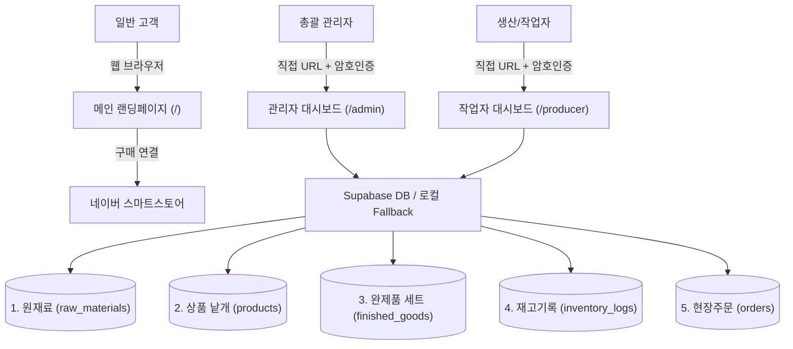

# [유자를 품은 오란다&까부리] 시스템 설계서 (System Design)

본 문서는 **"유자를 품은 오란다&까부리"** 서비스의 데이터베이스 모델, 계층 구조, 컴포넌트 아키텍처 및 디자인 시스템을 정의합니다.

---

## 1. 시스템 구조 개요

시스템은 **고객용 랜딩페이지**, **관리자 대시보드**, **생산자(작업자) 페이지**의 3개 독립 영역으로 분리 운영됩니다.



---

## 2. 데이터베이스 스키마 및 계층 설계

원재료, 상품, 완제품은 **"원재료 ➔ 상품(낱개) ➔ 완제품(세트)"**의 묶음(Composition) 관계를 형성하며, 공통 인터페이스와 상속 로직을 적용합니다.

### 2.1. 원재료 (`raw_materials`)
- **설명**: 오란다 및 까부리 제조에 투입되는 가공 전 1차 원부자재.
- **필드 정의**:
  - `id` (text, PK): 고유 식별자 (예: `mat_oranda_grain`, `mat_grain_syrup`)
  - `name` (text): 원재료명 (예: 오란다 알갱이, 쌀조청, 생유자청 등)
  - `stock` (numeric): 현재 잔여 재고량
  - `unit` (text): 재고 단위 (`kg`, `g`, `박스`, `개` 등)
  - `unit_price` (numeric, 선택): 단위당 단가 (단가 계산기 부가 기능 전용, 원재료 관리 화면에는 미노출)

### 2.2. 상품 (`products`)
- **설명**: 원재료들을 가공하여 생산된 낱개 단위의 기본 제품.
- **필드 정의**:
  - `id` (text, PK): 고유 식별자 (예: `prod_classic_single`, `prod_kkaburi_single`)
  - `name` (text): 상품명 (예: 유자 오란다 낱개, 유자 까부리 낱개)
  - `stock` (numeric): 현재 낱개 재고량
  - `materials` (jsonb): 포함 원재료 목록
    - 형식: `[{"name": "오란다 알갱이"}, {"name": "쌀조청"}, {"name": "생유자청"}]`
    - 단위가 유동적이므로 양은 기록하지 않으며 단순 기록용으로 참조 관리합니다.

### 2.3. 완제품 (`finished_goods`)
- **설명**: 낱개 상품들을 패키징하여 소비자에게 판매하는 최종 세트 상품.
- **필드 정의**:
  - `id` (text, PK): 고유 식별자 (예: `set_deundeun`, `set_silsok`, `set_mini`, `set_single`)
  - `name` (text): 세트 이름 (예: `[든든세트] 고흥 유자품은 까부리와 오란다`)
  - `set_type` (text): 세트 구분 (`든든`, `실속`, `미니`, `낱개`)
  - `price` (numeric): 판매 금액 (원)
  - `stock` (numeric): 현재 완제품 재고 수량 (박스/개 단위)
  - `composition` (jsonb): 포함 상품 구성 및 수량
    - 형식: `[{"product_id": "prod_classic_single", "name": "유자 오란다", "qty": 9}, {"product_id": "prod_kkaburi_single", "name": "유자 까부리", "qty": 9}]`

### 2.4. 재고 관리 기록 (`inventory_logs`)
- **설명**: 원재료, 상품, 완제품의 모든 재고 변동(생산, 입고, 출고, 손실 등)을 추적하는 감사 로그.
- **필드 정의**:
  - `id` (text, PK): 고유 식별자 (타임스탬프 기반)
  - `created_at` (timestamptz): 생성 일시
  - `updated_at` (timestamptz): 수정 일시
  - `reason` (text): 변경 사유 (예: "당일 정기 생산 등록", "원자재 입고", "폐기")
  - `changes` (jsonb): 세부 변경 내역 배열
    - 형식: `[{"category": "raw_materials", "item_id": "mat_grain", "name": "오란다 알갱이", "diff": -5, "unit": "kg"}, {"category": "finished_goods", "item_id": "set_deundeun", "name": "든든세트", "diff": +10, "unit": "박스"}]`

### 2.5. 현장 주문 (`orders`)
- **설명**: 매장/공장 현장에서 직접 접수된 완제품 판매 내역 (스마트스토어 주문은 네이버에서 별도 관리).
- **필드 정의**:
  - `id` (text, PK): 고유 식별자
  - `order_date` (timestamptz): 주문 일시
  - `customer_name` (text): 주문자명
  - `phone` (text): 연락처
  - `product_id` (text): 완제품 ID 참조
  - `product_name` (text): 완제품 상품명
  - `quantity` (numeric): 주문 수량
  - `status` (text): 주문 상태 (`주문 접수`, `상품 준비`, `수령 완료`, `취소`)
  - `memo` (text): 특이사항 메모
  - *합계 금액*: 완제품 테이블의 `price` × `quantity`로 자동 계산(비저장 파생 속성).

---

## 3. UI 및 컴포넌트 아키텍처

디자인 시스템을 공통화하여 관리자 및 작업자 페이지에서 코드를 재활용합니다.

```
components/common/
├── DataTable.jsx        # 상단 검색/필터/정렬 바 및 정형화된 데이터 테이블
├── ModalPopup.jsx       # 팝업 형태의 추가/수정 공통 모달
├── StockBadge.jsx       # 재고 수량에 따른 상태 뱃지 (정상/주의/부족/품절)
├── RecentLogViewer.jsx  # 재고 조절 버튼 옆에 표시되는 최근 수정 이력 칩/툴팁
└── CommonItemForm.jsx   # 원재료/상품/완제품 공통 수정 폼
```

---

## 4. 작업자 및 관리자 페이지 동작 흐름

### 4.1. 작업자 페이지 (`/producer`)
- **좌측 영역**:
  - 원재료 재고 증감 입력
  - 상품 낱개 생산 수량 입력
  - 완제품 세트 생산 수량 입력
  - 각 항목 옆에 `RecentLogViewer`를 배치하여 최근 변동 수치 즉각 확인
  - **[작업 내역 일괄 저장]** 버튼:
    - 클릭 시 사유 입력 팝업 노출 (자주 쓰는 템플릿 제공)
    - 저장 시 `raw_materials`, `products`, `finished_goods`가 원자적으로 업데이트되고 단일 `inventory_logs` 레코드가 생성됨.
- **우측 사이드바**:
  - 최근 변경 내역 목록 표시
  - 항목 클릭 시 수정 및 삭제 팝업 활성화, 수정 시 좌측 작업창으로 데이터 연동

### 4.2. 관리자 페이지 (`/admin`)
- **5대 핵심 테이블 뷰**:
  1. **주문 관리**: 현장 주문 내역, 상태 클릭 토글, 추가/수정/삭제
  2. **완제품 관리**: 세트 구성, 판매가, 재고, 팝업 수정
  3. **상품 관리**: 낱개 상품, 포함 원재료 리스트, 팝업 수정
  4. **원재료 관리**: 재고량, 단위, 팝업 수정 (단가/금액 필드는 미노출)
  5. **변경 내역**: 전체 재고 변경 내역(일시, 사유, 변경 상세)
- **상단 조작부**:
  - 실시간 검색(Search), 필터(Filter), 정렬(Sort: 이름순/재고순/최신순), 신규 등록(Add) 버튼
- **부가 기능**:
  - **단가 계산기**: 하드코딩 없이 원재료 DB와 연동되어 마진율 및 개당 원가 실시간 시뮬레이션
  - **랜딩페이지 설정**: 기존 랜딩 공지 및 카피 문구 편집 기능 독립 보존
